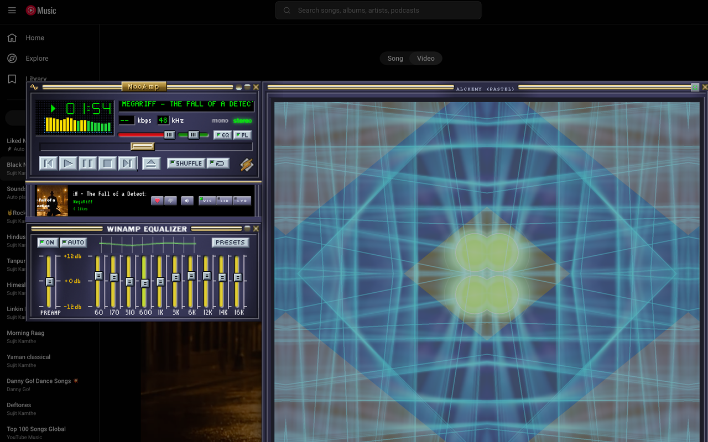
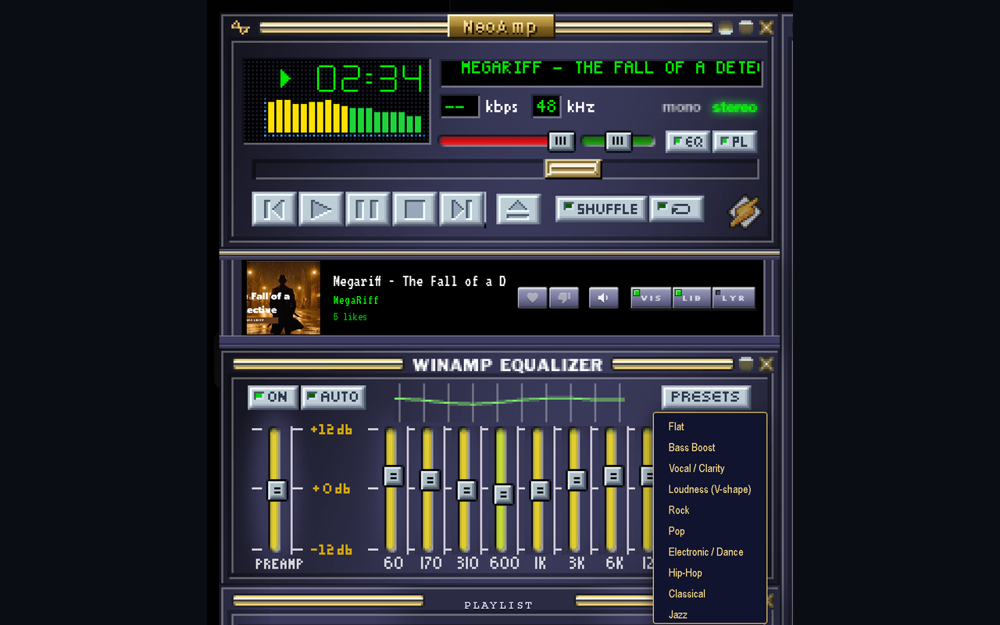
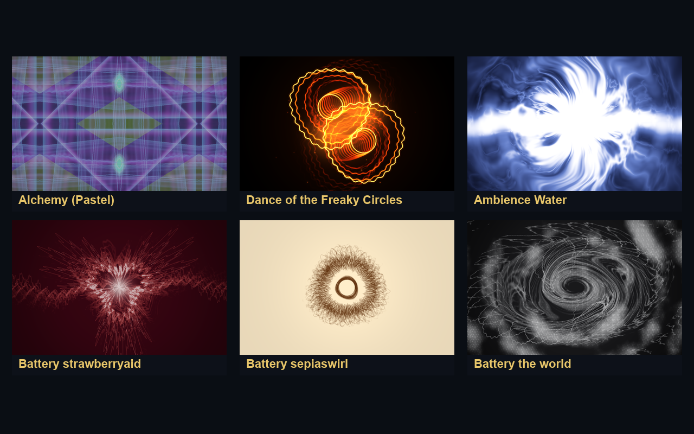
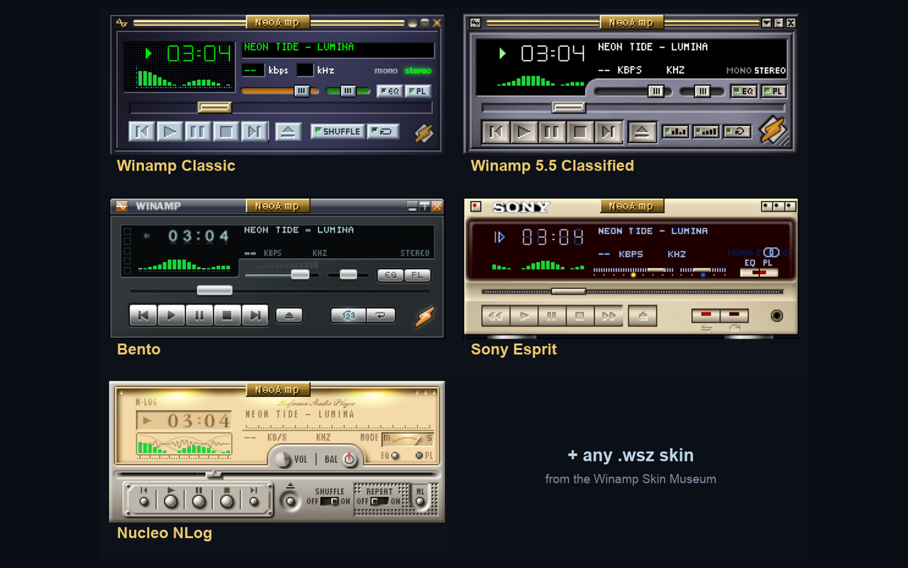
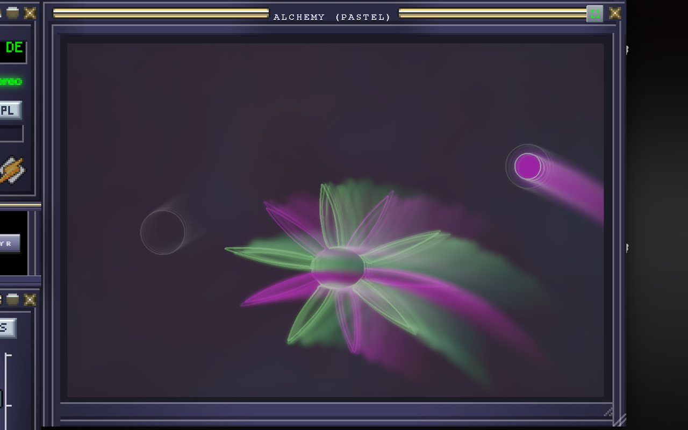

# NeoAmp 🎵◢◤

**A Winamp-style player + Windows Media Player / MilkDrop visualizations, overlaid on the music you stream in your browser.**

[](https://github.com/sujeet100/NeoAmp/actions/workflows/ci.yml)
[](https://github.com/sujeet100/NeoAmp/actions/workflows/codeql.yml)
[](https://scorecard.dev/viewer/?uri=github.com/sujeet100/NeoAmp)

NeoAmp is a **Manifest V3** Chrome / Arc / Edge extension that drops a floating,
skinnable **Winamp-style player** onto streaming sites (YouTube Music and Spotify
today) and renders **MilkDrop visualizations** — via
[Butterchurn](https://github.com/jberg/butterchurn) — driven by the **live audio of
the tab**. On top of Butterchurn's bundled MilkDrop presets, NeoAmp ships
**hand-authored presets that recreate the classic Windows Media Player visualizers**
— the _Alchemy_, _Battery_, and _Ambience_ families.

> Nostalgic for Winamp's MilkDrop and WMP's swirling Alchemy flower? NeoAmp brings
> that look — and a real, audio-shaping graphic EQ — back to the music you stream today.

<p align="center">
  
</p>

---

## Features

- 🪟 **Floating Winamp-style player UI** — draggable windows (main / equalizer /
  playlist / library), classic LCD readout, transport controls, volume/balance.
- 🎚️ **A real 10-band graphic EQ** — audio is captured with `chrome.tabCapture`
  in an offscreen document, so the EQ actually _shapes what you hear_, not just the
  visuals.
- 🌀 **MilkDrop visuals** reacting to the live track, including **hand-authored WMP
  recreations** — notably **Alchemy Random**, a self-sequencing engine (two-orb
  "Dance" waveform, dandelion/urchin bursts, spiral arms, kaleidoscope lens-bands,
  hexagon mesh, smoke plumes, comet streaks, …), plus the **Battery** and
  **Ambience** families.
- 🎨 **Skins** — real Winamp **`.wsz`** skins (rendered Webamp-style) plus
  lightweight CSS-variable themes. Ships with the classic base skin; load any other
  from the **[Winamp Skin Museum](https://skins.webamp.org/)** on demand (drag-drop /
  picker) — see the [skins note](./THIRD-PARTY-NOTICES.md#bundled-winamp-skins).
- 🔀 **Multi-provider** — works on **YouTube Music** and **Spotify**, with
  transport / seek / like / queue / volume / in-app search / **synced lyrics**.
  New providers are a data entry, not new code (see below).
- 📝 **Lyrics**, in-app **search**, **mute**, and keyboard shortcuts.
- 🔒 **Local & private** — no analytics, no tracking, no remote code. The only
  network call is fetching `selectors.json` for hot-fixable site selectors (see
  [PRIVACY.md](./PRIVACY.md)).

## Screenshots

> Captured live on YouTube Music, in the real **Winamp 5.5 Classified** `.wsz` skin
> (visualizer frames driven by the live audio).

|                                                                                                                                                                                            |                                                                                                                                                                              |
| :----------------------------------------------------------------------------------------------------------------------------------------------------------------------------------------: | :--------------------------------------------------------------------------------------------------------------------------------------------------------------------------: |
| <br>**The player + a real 10-band EQ** |   <br>**Hand-authored WMP visualizers**    |
|                     <br>**Real Winamp `.wsz` skins**                     | <br>**Alchemy (Pastel)** — a WMP recreation |

## Install (load unpacked)

There is no Chrome Web Store listing yet — install from source:

1. Clone this repo.
2. Go to `chrome://extensions` (Arc: `arc://extensions`, Edge: `edge://extensions`)
   and enable **Developer mode**.
3. **Load unpacked** → select this folder.
4. Open <https://music.youtube.com> or <https://open.spotify.com> and play a track.
5. Click the extension's toolbar icon (or press **Ctrl/Cmd + Shift + E**) to open
   the player + EQ. Use the **◢◤ Visualizer** launcher (or **Shift+V**) for the
   full-screen visuals.

> After editing `manifest.json`, click the **reload (↻)** icon on the extensions
> page. After editing other JS/CSS, reload the extension **and** the tab.

## How it works

```
                       ┌──────────────────────────────────────────────┐
 service worker (sw.js)│  coordinates capture + offscreen lifecycle    │
                       └──────────────────────────────────────────────┘
                                          │
 offscreen.js  ──  chrome.tabCapture  →  AudioContext  →  10-band EQ  →  speakers
                                              │                    └→ AnalyserNode (FFT)
                                              │                            │ postMessage
 content.js     (music.youtube.com / open.spotify.com — provider-coupled) │
   • injects the Winamp-style UI (winamp.js / winamp.css / wsz.js / skins.js)
   • reads now-playing from navigator.mediaSession (mediasession.js, world:MAIN)
   • drives transport via per-provider selectors (PROVIDERS registry + selectors.json)
                                              │
 viz.html  (sandboxed extension page, fullscreen iframe)                  ▼
   Butterchurn (WebGL, needs unsafe-eval)  ◄──────── postMessage (FFT bytes) ◄┘
   → renders the <canvas>  +  preset selector
```

Three deliberate, load-bearing design choices (full rationale in
[`CLAUDE.md`](./CLAUDE.md)):

- **A sandboxed iframe for rendering.** Butterchurn compiles MilkDrop equations
  with `new Function`, which needs `unsafe-eval`. MV3 only allows that in a
  **sandboxed extension page**, so Butterchurn runs in `viz.html`.
- **Audio via `chrome.tabCapture` in an offscreen document.**
  `createMediaElementSource` on the site's `<video>` returns all-zeros (cross-origin
  tainting), and content scripts can't keep an `AudioContext` alive across the SPA.
  Capturing the tab in an offscreen doc keeps audio audible **and** lets the EQ
  reshape it before it reaches the speakers.
- **Provider logic is data, not code.** The site-specific selectors live in a
  `PROVIDERS` registry mirrored in [`selectors.json`](./selectors.json), fetched at
  runtime — so a broken selector is hot-fixed by editing one file, no extension
  release. Now-playing comes from the web-standard `navigator.mediaSession`, not
  CSS scraping. Adding a provider = a registry entry + a manifest `matches` line.

## Repo layout

| Path                                        | Role                                                                                                                    |
| ------------------------------------------- | ----------------------------------------------------------------------------------------------------------------------- |
| `manifest.json`                             | MV3 manifest (content scripts, sandbox page, CSP, offscreen, web-accessible resources).                                 |
| `content.js`                                | UI injection, provider registry, transport wiring, audio-capture trigger.                                               |
| `sw.js` / `offscreen.html` / `offscreen.js` | Service worker + offscreen tab-capture + EQ + FFT.                                                                      |
| `mediasession.js`                           | `world:MAIN` script that reads `navigator.mediaSession` metadata.                                                       |
| `winamp.js` / `winamp.css`                  | The floating Winamp-style player UI.                                                                                    |
| `wsz.js` / `skins.js`                       | `.wsz` skin parser/renderer (Webamp-derived) + CSS-variable skin registry.                                              |
| `selectors.json`                            | Per-provider selectors, fetched at runtime for hot-fixing.                                                              |
| `viz.html` / `viz.js`                       | Sandboxed renderer: Butterchurn init, canvas sizing, controls, render loop.                                             |
| `presets/*.js`                              | Hand-authored WMP-style presets (`kit.js` shared kit + family files).                                                   |
| `vendor/*.min.js`                           | Vendored Butterchurn core + preset packs (MV3 bans remote code).                                                        |
| `vendor/skins/base-2.91.wsz`                | The one bundled default skin; others load at runtime — see [skins note](./THIRD-PARTY-NOTICES.md#bundled-winamp-skins). |
| `fonts/`                                    | Bundled bitmap fonts (VT323, Silkscreen) — both SIL OFL.                                                                |
| `tools/`                                    | Headless self-render harnesses (CDP) for iterating on visuals without the browser.                                      |
| `docs/`                                     | Design notes, reverse-engineering analysis, handoffs.                                                                   |
| `CLAUDE.md`                                 | Deep architecture notes + the preset-authoring guide.                                                                   |

## Security

NeoAmp runs on pages you're logged into and captures tab audio, so security matters. We
don't claim it's vulnerability-free — we run a process: **CodeQL**, a security-focused
**ESLint** (`no-unsanitized` + `security`), **retire.js** (for the vendored Butterchurn),
**gitleaks**, and **Dependabot** on every change, plus periodic adversarial review. As of
the last review there are **no known vulnerabilities**.

Found one? **Don't open a public issue** — report it privately via the repo's
[Security tab → Report a vulnerability](https://github.com/sujeet100/NeoAmp/security).
Full policy: **[SECURITY.md](./SECURITY.md)**.

## Contributing

See **[CONTRIBUTING.md](./CONTRIBUTING.md)**. The short version: most of the work is
**authoring presets** in `presets/` (a preset is a Butterchurn "converted" object —
equations are JS functions, shaders are GLSL strings) and **wiring providers** in
`content.js` / `selectors.json`. There's a Node-based validate-before-reload workflow
(including a headless ANGLE shader-compile check — GLSL can't be validated by Node
alone) documented in `CLAUDE.md`. This project follows the
[Contributor Covenant](./CODE_OF_CONDUCT.md).

## Credits & acknowledgements

NeoAmp stands on the shoulders of a lot of great work. Full details and licenses are
in **[THIRD-PARTY-NOTICES.md](./THIRD-PARTY-NOTICES.md)**.

- **[Butterchurn](https://github.com/jberg/butterchurn)** by **Jordan Berg**
  ([@jberg](https://github.com/jberg)) — the WebGL MilkDrop engine NeoAmp renders
  with. Vendored under `vendor/` (MIT).
- **[Webamp](https://github.com/captbaritone/webamp)** by **Jordan Eldredge**
  ([@captbaritone](https://github.com/captbaritone)) — our `.wsz` skin
  parsing/rendering (`wsz.js`) is derived from Webamp's `skinSprites` and
  `main-window.css` sprite geometry (MIT). Webamp is also the reference that proved
  classic Winamp skins can be rendered faithfully on the web.
- **MilkDrop** by **Ryan Geiss** — the original Winamp visualization plugin whose
  preset format and look everything here descends from.
- **Winamp** (Nullsoft / Llama Group) — the player UI, `.wsz` skin format, and the
  whole "it really whips the llama's ass" aesthetic we're paying homage to.
- **Windows Media Player** (Microsoft) — the Alchemy / Battery / Ambience
  visualizers we reverse-engineered and recreate as Butterchurn presets.
- Fonts: **[VT323](https://fonts.google.com/specimen/VT323)** by Peter Hull and
  **[Silkscreen](https://fonts.google.com/specimen/Silkscreen)** by Jason Kottke —
  both under the SIL Open Font License (see `fonts/`).
- The **[Winamp Skin Museum](https://skins.webamp.org/)** by Jordan Eldredge — where
  users browse and load additional `.wsz` skins (NeoAmp bundles only the base skin and
  does not redistribute community skins; see the
  [skins note](./THIRD-PARTY-NOTICES.md#bundled-winamp-skins)).

> **Trademarks.** _Winamp_, _Nullsoft_, _Windows Media Player_, _MilkDrop_,
> _YouTube Music_, and _Spotify_ are trademarks of their respective owners. NeoAmp is
> an independent, unaffiliated fan project. It reproduces the _visual character_ of
> these tools — color, motion, symmetry, audio-reactivity — not their proprietary
> code.

## License

NeoAmp's own code is licensed **[MIT](./LICENSE)**. Bundled third-party components
retain their own licenses — see [THIRD-PARTY-NOTICES.md](./THIRD-PARTY-NOTICES.md).
